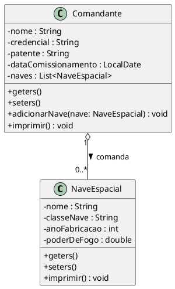

# Exercício: Sistema de Gerenciamento da Frota Galáctica

## 📖 Cenário

O ano é 2154. A Aliança Galáctica precisa de um novo sistema de terminal para gerenciar suas frotas estelares. Você foi o engenheiro de software escolhido para desenvolver o protótipo em Java.

O sistema deve ser capaz de registrar **Comandantes** e atribuir a eles diversas **Naves Espaciais**. Um Comandante pode não ter nenhuma nave (aguardando designação) ou possuir uma frota de várias naves sob seu comando.

---

## 📊 Diagrama de Classes

Abaixo está o modelo estrutural que você deve seguir para criar as classes de modelo (entidades), representado em PlantUML:

---

## 🛠️ Instruções de Implementação

### Parte 1: Classe `NaveEspacial`

1. Crie a classe e declare todos os atributos como **privados** para garantir o encapsulamento.
2. Gere os métodos *Getters* e *Setters* para todos os atributos.
3. Crie um método `imprimir()` que não retorna nada (`void`). Ele deve exibir no console os dados da nave formatados (com linhas separadoras, ex: `=== Dados da Nave ===`).

### Parte 2: Classe `Comandante`

1. Crie a classe com seus atributos básicos como **privados**.
2. Crie o relacionamento: adicione um atributo que seja uma **Lista** de `NaveEspacial`, inicializando-a vazia (exatamente como foi ensinado).
3. Gere os métodos *Getters* e *Setters* para os atributos simples. Para a lista, crie apenas o *Getter*.
4. Crie o método `adicionarNave(NaveEspacial nave)`. Este método deve receber um objeto do tipo nave e adicioná-lo à lista do comandante.
5. Crie um método `imprimir()`. Ele deve:
* Exibir os dados do Comandante.
* Verificar se a lista de naves está vazia. Se estiver, avisar "Nenhuma nave sob comando".
* Se não estiver vazia, exibir o total de naves e usar um laço de repetição (`for` ou `foreach`) para chamar o método `imprimir()` de cada nave presente na lista.

### Parte 3: Classe Principal `GerenciarFrota` (A Aplicação)

Esta será a classe que contém o `public static void main(String[] args)`. Ela deve gerenciar a interação com o usuário.

**Requisitos da Classe:**

1. Deve possuir uma Lista de `Comandante` (para armazenar todos os comandantes cadastrados) e um objeto `Scanner` para ler os dados do teclado.
2. Deve exibir um menu em loop (`do-while`) com a estrutura `switch-case`, contendo exatamente as seguintes opções:
* **1. Cadastrar Comandante:** Pede os dados do comandante (nome, credencial, patente, e os números do dia, mês e ano para formar o `LocalDate`) e adiciona o objeto na lista geral.
* **2. Designar Nave a um Comandante:**
* Primeiro, o sistema deve listar todos os Comandantes cadastrados, exibindo um ID (a posição na lista + 1) e o nome.
* O usuário digita o ID do comandante escolhido.
* O sistema pede os dados da nova Nave.
* O sistema cria a nave e a adiciona à lista daquele Comandante específico usando o método `adicionarNave()`.

* **3. Mostrar Frota Completa:** Varre a lista de comandantes e chama o método `imprimir()` de cada um (o que automaticamente imprimirá as naves deles).
* **4. Relatório: Naves por Comandante:** Varre a lista de comandantes imprimindo apenas o nome do comandante e o tamanho (`size()`) da sua lista de naves.
* **5. Total Geral de Naves na Aliança:** Calcula e exibe a soma de todas as naves de todos os comandantes juntos.
* **6. Total de Comandantes:** Exibe o tamanho da lista principal de comandantes.
* **9. Sair do Sistema:** Encerra o loop e finaliza o programa.

**Dica de Ouro:** Organize cada opção do menu em um método privado dentro da classe `GerenciarFrota`, exatamente como você faria em um terminal de estacionamento, para manter o código limpo e organizado!