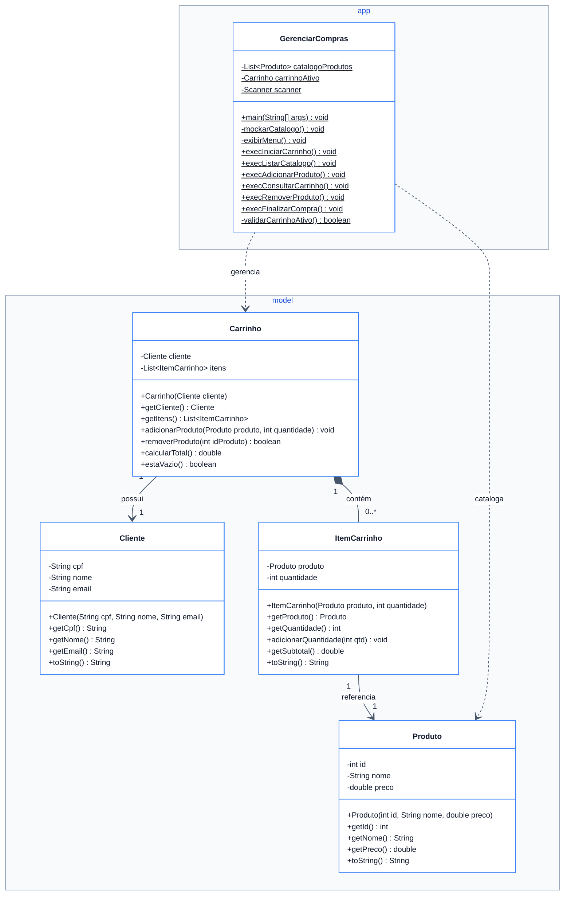

<link rel="stylesheet" href="style.css">

# Exercício Prático: Sistema de Gerenciamento de Carrinho de Compras

## 1. Contextualização e Objetivo

Você foi contratado para desenvolver o núcleo de regras de negócio e a interface de console de um sistema de compras (*e-commerce* simplificado) em Java, aplicando conceitos fundamentais de **Programação Orientada a Objetos (POO)**.

O objetivo da atividade é construir uma solução orientada a objetos que permita ao usuário criar um carrinho de compras vinculado a um cliente, consultar produtos disponíveis em um catálogo, adicionar e remover itens, atualizar quantidades de produtos repetidos, visualizar o extrato detalhado do carrinho e finalizar a compra.


## 2. Competências e Conceitos Avaliados

- **Encapsulamento**: Atributos privados e métodos de acesso e mutação controlados.
- **Relacionamentos entre Classes**:
  - Associação e Composição (`Carrinho` contém `Cliente` e lista de `ItemCarrinho`; `ItemCarrinho` referencia `Produto`).
- **Manipulação de Coleções**: Uso de `List` (`ArrayList`), iteração, busca e remoção condicional.
- **Modularização em Camadas/Pacotes**: Separação clara entre modelos de domínio (`model`) e camada executável/interface (`app`).
- **Regras de Negócio**: Totalização, cálculo de subtotais e controle de ciclo de vida do carrinho.


## 3. Estrutura de Pacotes

O projeto deve ser organizado na seguinte estrutura de pacotes:

```
src/
├── model/
│   ├── Cliente.java
│   ├── Produto.java
│   ├── ItemCarrinho.java
│   └── Carrinho.java
└── app/
    └── GerenciarCompras.java
```


## 4. Modelagem de Classes (Diagrama UML)




## 5. Especificação dos Modelos de Domínio (`model`)

### 5.1. Classe `Cliente`
Representa o comprador associado ao carrinho.

- **Atributos**:
  - `cpf` (`String`, privado): CPF do cliente.
  - `nome` (`String`, privado): Nome completo.
  - `email` (`String`, privado): Endereço de e-mail.
- **Construtor**: Recebe `cpf`, `nome` e `email` para inicializar todos os campos.
- **Métodos**:
  - Métodos *getters* para todos os atributos.
  - Sobrescrever `toString()` retornando o nome e o CPF formatados (ex: `"João Silva (CPF: 123.456.789-00)"`).


### 5.2. Classe `Produto`
Representa uma mercadoria disponível no catálogo.

- **Atributos**:
  - `id` (`int`, privado): Identificador numérico único do produto.
  - `nome` (`String`, privado): Nome/descrição do produto.
  - `preco` (`double`, privado): Preço unitário.
- **Construtor**: Recebe `id`, `nome` e `preco`.
- **Métodos**:
  - Métodos *getters* para todos os atributos.
  - Sobrescrever `toString()` retornando o ID, nome e preço formatado em reais com alinhamento tabular.


### 5.3. Classe `ItemCarrinho`
Representa uma linha de item dentro do carrinho, relacionando um produto à quantidade desejada.

- **Atributos**:
  - `produto` (`Produto`, privado): Instância do produto selecionado.
  - `quantidade` (`int`, privado): Quantidade adquirida desse item.
- **Construtor**: Recebe `produto` e `quantidade`.
- **Métodos**:
  - Métodos *getters* para `produto` e `quantidade`.
  - `adicionarQuantidade(int qtd)`: Incrementa a quantidade atual do item com o valor informado.
  - `getSubtotal()`: Retorna o valor total deste item (`preco do produto * quantidade`).
  - Sobrescrever `toString()` apresentando o nome do produto, quantidade, valor unitário e subtotal formatado.


### 5.4. Classe `Carrinho`
Gerencia a lista de itens e os cálculos do carrinho de um cliente.

- **Atributos**:
  - `cliente` (`Cliente`, privado): Cliente proprietário do carrinho.
  - `itens` (`List<ItemCarrinho>`, privado): Coleção contendo os itens adicionados.
- **Construtor**: Recebe o `Cliente` e inicializa a lista de itens vazia.
- **Métodos**:
  - `getCliente()`: Retorna o cliente.
  - `getItens()`: Retorna a lista de itens (preferencialmente como lista não modificável/somente leitura).
  - `adicionarProduto(Produto produto, int quantidade)`:
    - **Regra de Unicidade de Item**: Percorre a lista de itens. Se o produto (mesmo `id`) já estiver no carrinho, apenas incrementa a quantidade desse item existente chamando `adicionarQuantidade`. Se não existir, instancia um novo `ItemCarrinho` e adiciona à lista.
  - `removerProduto(int idProduto)`:
    - Remove o item cujo produto tenha o `id` fornecido. Retorna `true` se encontrou e removeu, ou `false` caso o produto não estivesse no carrinho.
  - `calcularTotal()`: Retorna a soma de todos os subtotais dos itens contidos no carrinho.
  - `estaVazio()`: Retorna `true` se o carrinho não contiver nenhum item, `false` caso contrário.


## 6. Especificação da Aplicação Console (`app.GerenciarCompras`)

A classe `GerenciarCompras` é o ponto de entrada da aplicação (`main`) e orquestra a interação com o usuário através do terminal.

### 6.1. Estrutura e Estado da Aplicação
- Deve manter uma lista estática de produtos (`catalogoProdutos`) pré-populada com itens de teste (mínimo de 5 produtos).
- Deve manter uma referência para o carrinho atualmente ativo (`carrinhoAtivo`), iniciando como `null`.
- Scanner para leitura de dados do teclado.

### 6.2. Menu Principal
Exibir continuamente um menu interativo até que a opção de saída (`0`) seja selecionada:

```
============= SISTEMA DE COMPRAS =============
1. Iniciar Novo Carrinho
2. Ver Catálogo de Produtos
3. Adicionar Produto ao Carrinho
4. Consultar Carrinho
5. Remover Produto do Carrinho
6. Finalizar Compra
0. Sair
==============================================
```

### 6.3. Regras de Cada Funcionalidade

1. **Opção 1 - Iniciar Novo Carrinho**:
   - Solicita Nome, CPF e E-mail do cliente.
   - Cria uma nova instância de `Cliente` e instancia um novo `Carrinho` atribuído a `carrinhoAtivo`.
   - Exibe mensagem de confirmação.

2. **Opção 2 - Ver Catálogo de Produtos**:
   - Exibe todos os produtos cadastrados no catálogo com seus respectivos IDs, nomes e preços.

3. **Opção 3 - Adicionar Produto ao Carrinho**:
   - Valida se existe carrinho ativo. Se não houver, alerta o usuário e encerra a ação.
   - Lista o catálogo de produtos para orientar a escolha.
   - Solicita o `ID` do produto e a `quantidade`.
   - Validações obrigatórias:
     - Quantidade deve ser maior que zero.
     - O `ID` informado deve existir no catálogo de produtos.
   - Adiciona o produto ao carrinho ativo e exibe confirmação.

4. **Opção 4 - Consultar Carrinho**:
   - Valida se existe carrinho ativo.
   - Exibe os dados do cliente.
   - Se o carrinho estiver vazio, informa que não há itens.
   - Se houver itens, lista cada item (com quantidade, preço unitário e subtotal) e exibe a linha com o **Total Geral**.

5. **Opção 5 - Remover Produto do Carrinho**:
   - Valida se há carrinho ativo e se o carrinho não está vazio.
   - Exibe o resumo atual do carrinho para facilitar a identificação do item.
   - Solicita o `ID` do produto a ser removido.
   - Executa a remoção e informa se foi removido com sucesso ou se o item não pertencia ao carrinho.

6. **Opção 6 - Finalizar Compra**:
   - Valida se há carrinho ativo e se ele contém pelo menos um item.
   - Exibe o resumo final com os itens e o valor total pago.
   - Exibe mensagem de confirmação informando que o recibo foi enviado ao e-mail do cliente.
   - Reseta o estado do `carrinhoAtivo` para `null` para permitir que uma nova compra seja iniciada.

7. **Tratamento de Exceções e Validações Gerais**:
   - Garantir que entradas inválidas no menu ou nas leituras numéricas (como digitação de letras em campos numéricos) sejam tratadas sem interromper a execução do programa (*crash*).
   - Validar mensagens amigáveis em todas as operações em que não há carrinho iniciado.


## 7. Exemplo de Fluxo de Execução no Terminal

```text
============= SISTEMA DE COMPRAS =============
1. Iniciar Novo Carrinho
2. Ver Catálogo de Produtos
3. Adicionar Produto ao Carrinho
4. Consultar Carrinho
5. Remover Produto do Carrinho
6. Finalizar Compra
0. Sair
==============================================
Escolha uma opção: 1

--- [Novo Carrinho] ---
Informe o Nome do cliente: Carlos Alberto
Informe o CPF: 111.222.333-44
Informe o E-mail: carlos@email.com
Carrinho inicializado com sucesso para: Carlos Alberto (CPF: 111.222.333-44)

Escolha uma opção: 3

--- [Catálogo de Produtos] ---
[1] Teclado Mecânico    R$   249.90
[2] Mouse Sem Fio       R$    89.50
[3] Monitor 24 Pol      R$   799.00
[4] Headset Gamer       R$   189.90
[5] Webcam Full HD      R$   149.00

Digite o ID do produto a incluir: 1
Informe a quantidade: 2
Produto adicionado: Teclado Mecânico (x2)

Escolha uma opção: 4

================ RESUMO DO CARRINHO ================
Cliente: Carlos Alberto (CPF: 111.222.333-44)
---------------------------------------------------
Teclado Mecânico   | Qtd:  2 | Unit: R$  249.90 | Subtotal: R$   499.80
---------------------------------------------------
TOTAL GERAL: R$ 499.80
===================================================

Escolha uma opção: 6

================ RESUMO DO CARRINHO ================
Cliente: Carlos Alberto (CPF: 111.222.333-44)
---------------------------------------------------
Teclado Mecânico   | Qtd:  2 | Unit: R$  249.90 | Subtotal: R$   499.80
---------------------------------------------------
TOTAL GERAL: R$ 499.80
===================================================

Compra finalizada com sucesso no valor de R$ 499.80!
Recibo enviado para: carlos@email.com
```


## 8. Critérios de Avaliação

| Critério | Descrição |
| :--- | :--- |
| **Modelagem e Encapsulamento** | Aplicação correta de modificadores de visibilidade (`private`), construtores e métodos de acesso/mutação. |
| **Relacionamentos e Regras de Negócio** | Agrupamento de itens no carrinho evitando duplicação de produtos e cálculos corretos de subtotal e total. |
| **Tratamento de Dados e Validações** | Validação de carrinho ativo, IDs válidos, quantidades positivas e tratamento de entradas não numéricas. |
| **Interface e Usabilidade** | Menu intuitivo, saídas tabulares bem formatadas e mensagens informativas ao usuário. |
| **Organização do Projeto** | Separação em pacotes `model` e `app` respeitando a responsabilidade de cada classe. |
