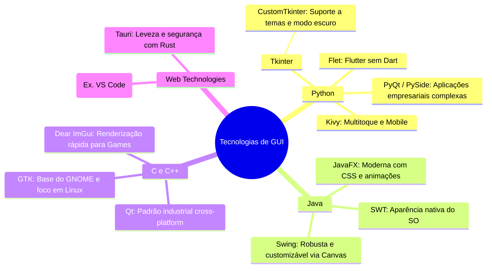

# Interfaces GUI para Desktop

## Lista

Abaixo apresento uma lista de bibliotecas por linguagem.

```mermaid
mindmap
  root((Tecnologias de GUI))
    Python
      Tkinter
        CustomTkinter: Suporte a temas e modo escuro
      PyQt / PySide: Aplicações empresariais complexas
      Flet: Flutter sem Dart
      Kivy: Multitoque e Mobile
    Java
      Swing: Robusta e customizável via Canvas
      JavaFX: Moderna com CSS e animações
      SWT: Aparência nativa do SO
    C e C++
      Qt: Padrão industrial cross-platform
      GTK: Base do GNOME e foco em Linux
      Dear ImGui: Renderização rápida para Games
    Web Technologies
      Electron: HTML/CSS/JS (Ex. VS Code)
      Tauri: Leveza e segurança com Rust
```